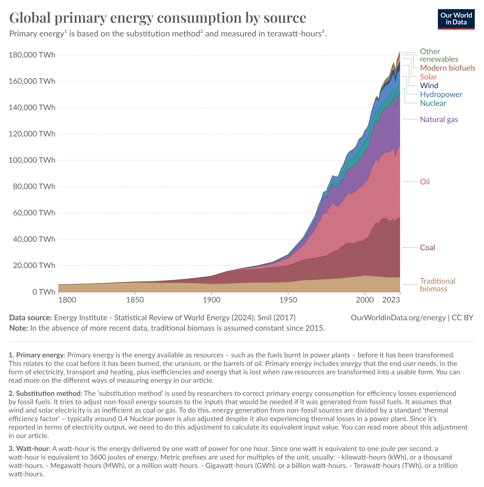

| [home page](https://cmustudent.github.io/tswd-portfolio-templates/) | [visualizing debt](visualizing-government-debt) | [critique by design](critique-by-design) | [final project I](final-project-part-one) | [final project II](final-project-part-two) | [final project III](final-project-part-three) |

# Design Critique with Tableau
The following page is a critique of data from the Makeover Monday website that works with given data to create more effective visualizations. The data visualization chosen for this activity was [Global Energy Consumption by Source](https://ourworldindata.org/grapher/global-energy-substitution?time=1800..2023) 

## Step one: the visualization

The following image is the original visualization produced by the [Energy Institute](https://ourworldindata.org/grapher/global-energy-substitution?time=1800..2023) that was used for this critique and redesign process. 

Note that there are features such as the 'play' button that starts the time lapse, the hyperlink-like definitions in the title (In the image below, the definitions are under the visualization instead), as well as the area in which users can hover over and see the total yearly energy use with the breakdown of each source. These are limitations to the redesigned visualization that is presented at the end of this page. 

### Citation
Energy Institute - Statistical Review of World Energy (2024); Smil (2017) – with major processing by Our World in Data. “Primary energy from biofuels” [dataset]. Energy Institute, “Statistical Review of World Energy”; Smil, “Energy Transitions: Global and National Perspectives” [original data].

## Step two: the critique

This visualization presents a large amount of data, and at first, one may think that they fully understand what this all is trying to show. The critique below was inspired by the [Data Visualization Effectiveness Profile](https://www.perceptualedge.com/articles/visual_business_intelligence/data_visualization_effectiveness_profile.pdf) by Stephen Few. 

Before starting the redesign process, I critiqued the visualization above. The following is a summary of observations and questions that I had concerning the visualization. These points reflect the changes that I wanted to make for the redesign of this visualization.

- The time lapse is too fast 
- There needs to be a label for the Y-axis
- Who will want to see the data from 1800?
- The title does not reflect the years that the visualization shows
- The areas at the top are difficult to select because they are small
- What does 'other renewables,' 'traditional,' and 'modern' biomass mean? (Define like primary energy and terra-watt-hour)
- I can only understand how much of each energy source was used for the year if I hover over the area of that specific energy source. 
- Is it necesarry to include the 'global substitution' variable in the chart?

## Step three: Sketch a solution
The following was created in Tableau and is the first redesign of the original [Energy Institute](https://ourworldindata.org/grapher/global-energy-substitution?time=1800..2023) data 

Note: I was unable to make all the changes that I wanted to because of my level of familiarity with Tableau

<noscript></noscript><object class='tableauViz'  style='display:none;'><param name='host_url' value='https%3A%2F%2Fpublic.tableau.com%2F' /> <param name='embed_code_version' value='3' /> <param name='site_root' value='' /><param name='name' value='Redesign1&#47;YearlyGlobalEnergyConsumptionbySource' /><param name='tabs' value='no' /><param name='toolbar' value='yes' /><param name='static_image' value='https:&#47;&#47;public.tableau.com&#47;static&#47;images&#47;Re&#47;Redesign1&#47;YearlyGlobalEnergyConsumptionbySource&#47;1.png' /> <param name='animate_transition' value='yes' /><param name='display_static_image' value='yes' /><param name='display_spinner' value='yes' /><param name='display_overlay' value='yes' /><param name='display_count' value='yes' /><param name='language' value='en-US' /><param name='filter' value='publish=yes' /></object>
                

## Step four: Test the solution

This section was used to get critique of the redesign of the original visualization. 

Questions to ask (modify these for your own interviews): 

1. What do you think this is?
2. What do you think this visualization is trying to share?
3. Is there anything you find surprising or confusing?
4. Who do you think the intended audience for this is?
5. Is there anything you would change or do differently?

Results: 

Interview 1: 30 year old, software engineer 
Interview 2: 23 year old, graduate student 

| Question | Interview 1 | Interview 2 |
|----------|-------------|-------------|
|    1     |    This chart is showing the yearly global use of different energy sources         |   The graph illustrates the time series trend of global energy use in terawatt-hours (TWh), categorized by energy source          |
|    2     |    The piece appears to be arguing that we're increasing consumption of gas, goal, and oil at unsustainable rates         |      It indicates a general increase in energy consumption over time, with oil, coal, and gas showing significant growth. Early years saw low energy use from alternative sources        |
|    3     |    Traditional Biomass is unclear        |             |
|    4     |    I could see this being made for energy use activists or policy makers         |             |
|    5     |    The piece does not make it clear who is using this energy         |             |

Synthesis: 
From the interviews, it is clear that parts of the visualization were not clear. For example

## Step five: build the solution
This is the final redesign that I created. Similar to the image in Step One, I decided to add other definitions that may be confusing to the audience. Because I could not use Tableau to create the hyperlink-like definitions like the original visualization that can be seen using the [link](https://ourworldindata.org/grapher/global-energy-substitution?time=1800..2023), I placed these definitions at the top as a separate appendix to reference when looking at the chart. The line chart fits best given the amount of time provided, however I thought about creating individual pie charts for each year to show the relative amount of energy from each source. The final redesign that I created ended up being two separate line charts, one with the yearly energy use of non-renewable sources from 1950-2023 and the second with the yearly energy use of clean sources from 1950-2023. These charts show the yearly energy of these sources alone, and I decided to not include the yearly total because I felt that I could not clearly represent them boht in one chart with Tableau. 

### Appendix I: Visualization Definitions 

- Clean Energy: Energy that is produced with little to no greenhouse gas emissions when compared to non-renewable energy sources such as coal, oil, and gas. 
- Substitution Method: The ‘substitution method’ is used by researchers to correct primary energy consumption for efficiency losses experienced by fossil fuels. It tries to adjust non-fossil energy sources to the inputs that would be needed if it was generated from fossil fuels. It assumes that wind and solar electricity is as inefficient as coal or gas.To do this, energy generation from non-fossil sources are divided by a standard ‘thermal efficiency factor’ – typically around 0.4 Nuclear power is also adjusted despite it also experiencing thermal losses in a power plant. Since it’s reported in terms of electricity output, we need to do this adjustment to calculate its equivalent input value.
- Terrawatt hour: A watt-hour is the energy delivered by one watt of power for one hour. Since one watt is equivalent to one joule per second, a watt-hour is equivalent to 3600 joules of energy. A Terawatt-hours (TWh), or a trillion watt-hours.

<noscript></noscript><object class='tableauViz'  style='display:none;'><param name='host_url' value='https%3A%2F%2Fpublic.tableau.com%2F' /> <param name='embed_code_version' value='3' /> <param name='site_root' value='' /><param name='name' value='Redesign2-Gascoaloil&#47;YearlyGlobalEnergyConsumptionbySource' /><param name='tabs' value='no' /><param name='toolbar' value='yes' /><param name='static_image' value='https:&#47;&#47;public.tableau.com&#47;static&#47;images&#47;Re&#47;Redesign2-Gascoaloil&#47;YearlyGlobalEnergyConsumptionbySource&#47;1.png' /> <param name='animate_transition' value='yes' /><param name='display_static_image' value='yes' /><param name='display_spinner' value='yes' /><param name='display_overlay' value='yes' /><param name='display_count' value='yes' /><param name='language' value='en-US' /><param name='filter' value='publish=yes' /></object>
                

<noscript></noscript><object class='tableauViz'  style='display:none;'><param name='host_url' value='https%3A%2F%2Fpublic.tableau.com%2F' /> <param name='embed_code_version' value='3' /> <param name='site_root' value='' /><param name='name' value='Redesign2-CleanSources&#47;YearlyGlobalEnergyConsumptionbyRenewableSource' /><param name='tabs' value='no' /><param name='toolbar' value='yes' /><param name='static_image' value='https:&#47;&#47;public.tableau.com&#47;static&#47;images&#47;Re&#47;Redesign2-CleanSources&#47;YearlyGlobalEnergyConsumptionbyRenewableSource&#47;1.png' /> <param name='animate_transition' value='yes' /><param name='display_static_image' value='yes' /><param name='display_spinner' value='yes' /><param name='display_overlay' value='yes' /><param name='display_count' value='yes' /><param name='language' value='en-US' /><param name='filter' value='publish=yes' /></object>
                

